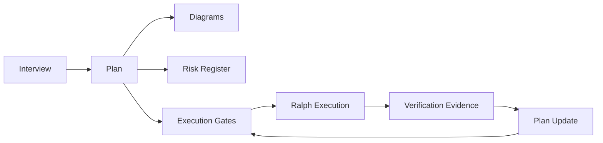
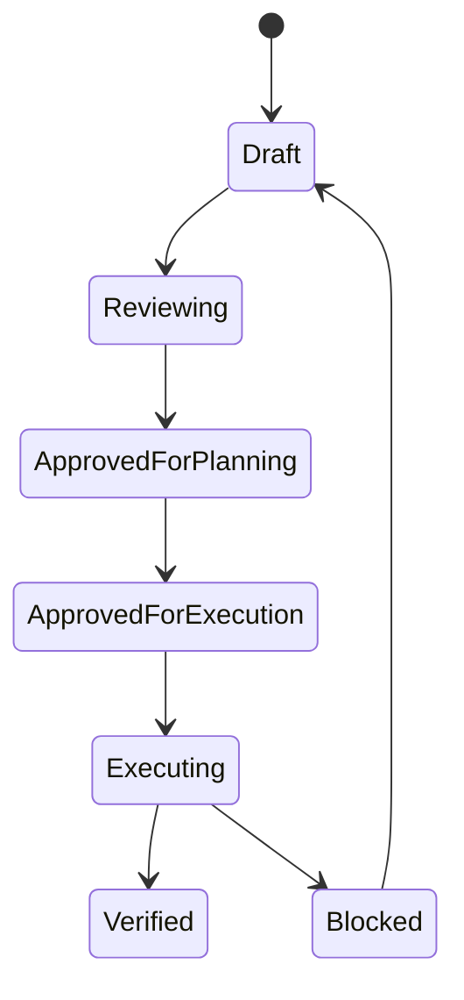

# Planning Visualization Guide

This guide defines how AI_AUTO should turn interview and planning artifacts into
visual, reviewable, and editable project control documents without building a
custom planning module.

The default stack is:

- Markdown for the source-of-truth plan
- Mermaid for lightweight diagrams inside Markdown
- Structurizr DSL for long-lived system maps when the architecture becomes
  complex
- Excalidraw for user-facing explanation drawings and interview whiteboards

Use existing editor support in VS Code, Antigravity (the user's configured
secondary IDE), GitHub Markdown preview, Structurizr, and Excalidraw. Do not
add a new app or repo-specific planning runtime unless a later plan explicitly
approves it.

The default operating mode is plugin-first:

- use editor plugins for Mermaid preview, Structurizr DSL viewing, and
  Excalidraw editing
- keep source files in the repository so AI agents can read and diff them
- install separate CLIs only when a project needs automated rendering,
  syntax validation, CI checks, or reproducible exports
- document the chosen validation surface in the project plan before relying on
  Structurizr or rendered diagrams as execution evidence

## Planning Artifact Language

Planning, strategy, architecture, and operations documents should be written in
Korean by default when they are meant for project-owner review or long-term
operation. The goal is for the project owner to understand, challenge, and run
the plan without translating AI-generated control documents first.

Keep machine-readable keys, commands, file paths, verdicts, schema fields,
status values, code identifiers, and external API names in English. Mermaid and
Structurizr identifiers may stay English when that makes diagrams easier for AI
tools to parse, but human-facing labels and explanatory notes should be Korean
unless the user asks otherwise.

Existing English planning documents should remain English unless the user
explicitly asks for translation or the document is already being revised for
that purpose. Do not rewrite old planning artifacts only to normalize language.

## Roles

| Tool | Role | Source Of Truth |
| --- | --- | --- |
| Markdown | Plan contract, decisions, risks, gates, acceptance criteria | Yes |
| Mermaid | Inline flow, state, sequence, and gate diagrams | Yes for the diagram it represents |
| Structurizr | System model and architecture views | Yes for long-lived system structure |
| Excalidraw | Human-friendly overview, interview sketch, stakeholder explanation | No, unless explicitly promoted |

Keep responsibility separate:

- Markdown is the contract.
- Mermaid is the local diagram embedded in that contract.
- Structurizr is the architecture model.
- Excalidraw is the explanatory drawing.

Do not maintain the same source-of-truth diagram in both Mermaid and
Structurizr. If both exist, the file must state which one owns the model.

## When To Use Each Tool

Use Markdown only when the plan is small, short-lived, or entirely textual.

Add Mermaid when the plan needs any of these:

- execution flow
- approval gate flow
- state transitions
- data movement
- incident or rollback path
- user journey
- dependency sequence

Add Structurizr when the project needs durable architecture management:

- multiple containers or services
- external systems such as broker APIs, Odoo, databases, or notification tools
- environment boundaries such as stage, dry-run, read-only production, and live
- several audiences needing different architecture views
- repeated Ralph loops that change system boundaries

Structurizr diagrams should be viewed or validated through the team's chosen
Structurizr surface, such as Structurizr Lite, Structurizr CLI, hosted
Structurizr, or a repo-documented editor workflow. If no surface is available
yet, keep the architecture diagram in Mermaid until a setup path is documented.

Add Excalidraw when the plan needs a stakeholder-friendly view:

- interview whiteboard
- one-page system overview
- non-developer explanation
- meeting artifact
- onboarding image for a project README or overview page

Excalidraw should not replace risk gates, decision logs, acceptance criteria, or
architecture ownership.

## Recommended Folder Shape

For project-level planning:

```text
docs/plans/<project-name>/
  00-overview.md
  01-interview.md
  02-plan.md
  03-diagrams.md
  04-risk-register.md
  05-decision-log.md
  06-gates.md
  07-progress.md
  structurizr/
    workspace.dsl
  whiteboard/
    overview.excalidraw
    overview.svg
    overview-spec.md
```

For smaller plans, keep fewer files:

```text
docs/plans/<project-name>.md
docs/plans/<project-name>-diagrams.md
```

Use separate folders for high-risk projects such as trading automation,
production data collection, credentialed workflows, migrations, and deployment
plans.

## Plan Frontmatter

Long-lived plan artifacts should start with a small metadata block:

```yaml
---
status: draft
owner: user
risk_level: high
last_reviewed: <YYYY-MM-DD>
source_of_truth:
  plan: 02-plan.md
  architecture: structurizr/workspace.dsl
  explanatory_view: whiteboard/overview.excalidraw
next_gate: approve dry-run evidence
allowed_next_modes:
  - ralplan
  - ralph
blocked_until:
  - live-order policy reviewed
  - kill-switch criteria documented
---
```

Valid status values:

- `draft`
- `reviewing`
- `approved-for-planning`
- `approved-for-execution`
- `blocked`
- `deferred`
- `superseded`

Do not mark a plan `approved-for-execution` unless the execution gate required
by `docs/INTERVIEW_PLAN_LAYER.md` is present.

## Minimum Diagram Set

For standard plans, include at least one Mermaid diagram when it clarifies the
execution path.

For high-risk plans, include:

- a flow diagram
- a gate or state diagram
- a data or system-boundary diagram
- a risk or rollback path when the plan can affect production, credentials,
  data, trading, deployment, or user-visible operations

Use `docs/plans/_templates/high-risk-diagrams.md` as the starter when a plan
touches credentials, production data, live deployment, trading, migrations, or
external systems with side effects.

Example planning flow:



Example execution state gate:



## Trading Automation Guidance

This section applies only when the project involves trading automation. Skip it
for unrelated projects.

Trading automation plans must prefer explicit visual gates over prose-only
plans. A trading plan should show:

- data source boundaries
- strategy decision path
- risk gate path
- order-generation path
- order-block path
- dry-run, read-only production, live-small-size, and kill-switch states
- monitoring and operator intervention path

Trading plans must keep these in Markdown or Mermaid/Structurizr, not only in
Excalidraw:

- live-order approval conditions
- maximum loss, order count, symbol, and time limits
- kill-switch criteria
- rollback and stop conditions
- production data and credential boundaries
- evidence required before promotion

## VS Code And Antigravity Workflow

Recommended daily workflow:

1. Edit Markdown plan files in VS Code or Antigravity.
2. Preview Mermaid diagrams in Markdown preview.
3. Edit Structurizr DSL when system boundaries change.
4. Edit Excalidraw only for the human-facing overview.
5. Export Excalidraw to SVG or PNG when it is embedded in Markdown.
6. Review git diff before execution starts.

Use text-native artifacts first. Binary image exports are acceptable for
readability, but the editable source file must stay in the repo when the image
is part of the plan.

## Excalidraw To Spec Draft Workflow

Excalidraw files may be used as AI-readable UI and planning input when they are
paired with a Markdown spec. The `.excalidraw` file is the editable sketch; the
`*-spec.md` file is the implementation-facing interpretation.

Recommended file pairing:

```text
docs/plans/<project-name>/whiteboard/
  overview.excalidraw
  overview.svg
  overview-spec.md

docs/plans/<project-name>/ui/
  feedback-panel.excalidraw
  feedback-panel.svg
  feedback-panel-spec.md
```

The spec file is not generated automatically by Excalidraw. AI_AUTO may draft
or refresh it by reading the `.excalidraw` JSON, the exported SVG/PNG when
helpful, and the related Markdown plan. A human must review the draft before it
becomes an execution contract.

If the `.excalidraw` file cannot be parsed, the layout is too complex to infer
safely, or the export does not match the editable source, AI_AUTO must leave the
spec as `draft`, add an `Open Questions` section, and avoid converting the
drawing into implementation requirements.

For trivial, low-risk sketches, a separate `*-spec.md` is optional. The drawing
may be embedded directly in the relevant Markdown plan when it does not define
implementation behavior, risk gates, UI states, or approval boundaries.

Projects may choose exported SVG files with embedded Excalidraw scene data when
that reduces file drift. If embedded exports are used, the plan must state
whether the `.svg` or the `.excalidraw` file is the editable source of truth.

Use `docs/plans/_templates/excalidraw-spec-template.md` as the starter for
implementation-facing specs generated from Excalidraw drawings.

Use this workflow:

1. Draw the screen, flow, or system sketch in Excalidraw.
2. Use clear labels for regions, actions, states, and risky operations.
3. Keep labels and notes in the user's preferred language when that is clearer.
4. Ask AI_AUTO to generate or update the paired `*-spec.md`.
5. Treat the generated spec as `draft` until a human reviews it.
6. Review the spec for intent, missing states, unsafe actions, and layout
   assumptions.
7. Promote the reviewed spec to the plan by linking it from `02-plan.md`,
   `03-diagrams.md`, or the relevant frontmatter field.

AI-generated specs must preserve uncertainty. If the drawing is ambiguous, the
spec should include an `Open Questions` section instead of inventing behavior.

## Update Rules During Ralph Loops

Before a Ralph execution loop starts:

- confirm the plan source of truth
- confirm the next gate
- confirm which diagrams must change if implementation changes

During the loop:

- update Mermaid when a flow, state, gate, or data path changes
- update Structurizr when a system, container, component, or external
  dependency boundary changes
- update Excalidraw only when the stakeholder-facing explanation becomes
  misleading
- if an Excalidraw file appears stale but the agent cannot safely update it,
  mark the paired `*-spec.md` or plan section as stale and add an open question
  instead of silently rewriting the drawing

Before claiming completion:

- update the plan status or explain why it did not change
- compare the final implementation diff with the plan/spec/design artifacts and
  classify the result as aligned, updated, not applicable, or blocked. If the
  status is `blocked`, explain the material scope change separately.
- update the risk register for new accepted risks
- update the decision log for new accepted or rejected directions
- update diagrams that no longer match implementation evidence
- report any intentionally stale visual artifact

## Review Checklist

Before a plan is treated as ready for execution, check:

- the Markdown plan has goal, non-goals, success criteria, constraints, risk
  gates, assumptions, user decisions, open questions, execution boundaries,
  verification plan, stop condition, evidence references, and readiness state
- critical ambiguity is 0%
- open questions are excluded from execution scope
- Mermaid diagrams match the current plan text
- Structurizr exists when system boundaries are too complex for Mermaid alone
- Excalidraw is labeled as explanatory if present
- high-risk actions have explicit gates
- the next Ralph loop has a bounded execution scope

## Anti-Patterns

Avoid:

- treating Excalidraw as the only plan artifact
- duplicating the same architecture source of truth in Mermaid and Structurizr
- updating diagrams without updating gates or decisions
- leaving diagrams stale after implementation changes
- adding a custom planning module before proving Markdown-based operations are
  insufficient
- using visual polish as a substitute for risk gates, tests, or evidence
