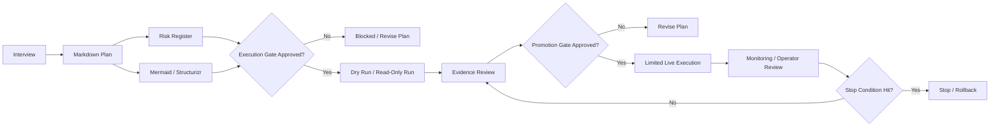
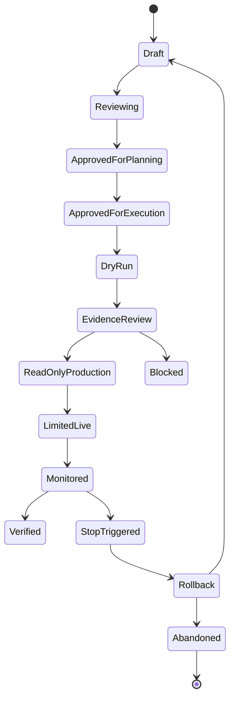
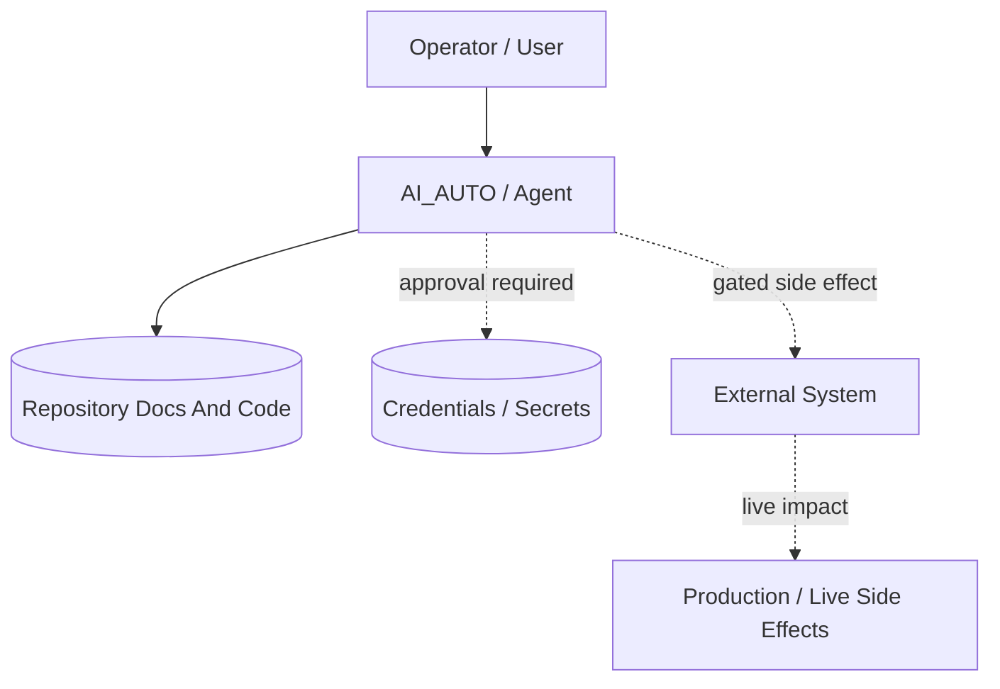

# High-Risk Plan Diagram Starter

Use this starter for plans that touch credentials, production data, live
deployment, trading, migrations, external side-effect APIs, or user-visible
operations.

## Execution Flow

## Execution State Gate

## Boundary Map

Use Mermaid for small systems and Structurizr DSL for durable architecture.

## Required Gate Fields

- approval owner
- allowed execution mode
- blocked actions
- credential boundary
- production/data boundary
- rollback or stop condition
- evidence required before promotion
- monitoring owner
