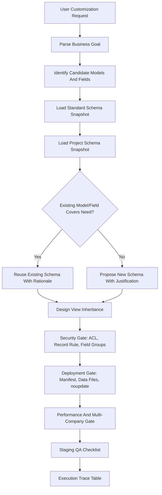

# Odoo.sh KB Implementation & Specification Plan (Refined)

Date: 2026-06-04
Status: Promoted KB, published to Obsidian target
Source index: `plans/ODOO_SH_KB_SOURCE_INDEX_2026-06-04.md`

Current scope note: AI_AUTO guidance/instruction integration is on hold while those files are being edited separately. This plan currently authorizes only Odoo KB documents and Odoo KB plan/TODO/source-index files.

## 1. Target Result

Create an Obsidian-ready Odoo.sh customization knowledge base (KB) that enforces consistent AI-assisted requirement analysis, database schema reuse, field design, view inheritance, model/record security, deployment hygiene, and staging validation.

The KB is the decision layer that teaches the AI to use factual metadata before proposing custom code. Its primary invariant is:

> No model, field, view, security, or deployment proposal is complete until it is tied to the current schema snapshot, an explicit source-backed rule, and a staging validation check.

## 2. Inputs And Acceptance Gates

### KB Promotion Inputs

1. Obsidian vault path and target folder name: `/mnt/z/JSJEON/Obsidian/AI_AUTO_Vault/AI_AUTO/Odoo.sh KB`.
2. Odoo major version: `19.0` confirmed.
3. Scoped KB validator or equivalent documented validation output.

### Project Runtime Inputs

These are not KB promotion blockers. They are required only when using the KB for an implementation-ready answer inside a specific Odoo project.

1. Project name and target custom module repository path.
2. Standard schema snapshot, for example `odoo19-standard-fields.json`.
3. Project schema snapshot, for example `project-fields.json`.
4. Optional current module list.

### Input Acceptance Rules

- Odoo major version is confirmed as `19.0` for this KB baseline.
- Standard and project schema snapshots must remain separate per project.
- The standard snapshot is advisory baseline evidence.
- The project snapshot is project-specific runtime evidence for proposed model/field reuse.
- If the project snapshot is missing during a project task, the KB may draft only a `schema-pending` proposal and must not produce implementation-ready code.
- Schema files must be treated as factual snapshots, not as evergreen truth. Every generated spec must record the snapshot file name, timestamp if available, and lookup result.
- Private database names, connection strings, mounts, raw credentials, SSH keys, screenshots, and personal file paths must not be copied into the KB.
- Schema snapshot shape must be documented before large snapshot files are used. Minimum keys: Odoo version, generated date, source label, model technical name, field technical name, field type, relation, compute/store/related/company/security metadata where available.

### Status Vocabulary

Final output status MUST be one of: `ready`, `schema-pending`, `security-pending`, `staging-pending`, `blocked`.

Evidence table status MUST be one of: `pending`, `pass`, `fail`, `blocked`, `not-applicable`.

Use `schema-pending` when schema evidence is missing. Use `blocked` only when a missing approval or non-schema input prevents even a useful draft/spec answer.

## 3. Schema-First Architecture



### Hallucination Safety Gate

Every generated customization spec must include a schema lookup table:

| Candidate | Type | Standard Snapshot | Project Snapshot | Decision |
| --- | --- | --- | --- | --- |
| `model.field_name` | field/model/view | found/missing/not checked | found/missing/not checked | reuse/new/defer |

If any required lookup is `not checked`, final status MUST be `schema-pending` and implementation-ready code MUST NOT be produced.

## 4. Core KB Documents

The first KB version has 7 Markdown guides under `Odoo.sh KB/`.

### 1. `AI-Working-Principles.md`

Purpose: define behavioral invariants for AI-assisted Odoo customization.

Required contents:

- Fact/assumption separation.
- Schema-first lookup before naming fields or models.
- "Reuse before create" rule.
- Implementation status labels: `ready`, `schema-pending`, `security-pending`, `staging-pending`, `blocked`.
- Execution trace table requirement.
- Source-backed rule requirement: each strong rule must map to the source index or be labeled as local project policy.

### 2. `Schema-Usage-Guide.md`

Purpose: teach how to query standard and project schema snapshots.

Required contents:

- Snapshot metadata template: file, generated date, Odoo version, database/project label, extraction method.
- Snapshot file shape example and key mapping rule for JSON/CSV variants.
- Large-file lookup examples using local commands such as `rg` or `jq`, with only relevant rows pasted into AI context.
- Candidate model discovery by model technical name, display name, `_rec_name`, and relationship fields.
- Candidate field discovery by technical name, field type, relation target, `store`, `compute`, `related`, `company_dependent`, `check_company`, `groups`.
- Relationship duplication checks for `Many2one`, `One2many`, and `Many2many`.
- Blocking rule: a field that exists in standard/project schema must be evaluated for reuse before adding any `x_` or custom field.

### 3. `Field-Design-Guide.md`

Purpose: standardize Odoo field definitions and computed logic.

Required contents:

- Naming conventions:
  - `Many2one` ends in `_id`.
  - `One2many` and `Many2many` end in `_ids`.
- Field type decision table:
  - `Selection` for short, stable enumerations.
  - `Many2one` to configuration models for user-editable or growing lists.
  - `company_dependent=True` only when one logical record needs different values per company.
  - `check_company=True` for relational consistency where cross-company leakage is possible.
- Compute-field rules:
  - `@api.depends(...)` must cover fields read by the compute method.
  - `@api.depends_context('company')` is required when computed output changes by active company.
  - Avoid expensive stored computes over deep or high-cardinality relations unless justified.
  - Use batch-oriented computations and `_read_group`/prefetch patterns where applicable.
- Index rule:
  - Add indexes only for fields used in meaningful search/domain paths; avoid indexing every field.

### 4. `View-Customization-Guide.md`

Purpose: standardize inherited view design.

Required contents:

- Prefer inherited views over direct upstream view edits.
- Anchor XPath to stable model/view facts, especially `field[@name='...']`, named groups/pages, or exact node attributes.
- Reject positional-only XPath such as `//form/sheet/group[1]/field[2]`.
- Use Odoo's `hasclass()` extension where CSS class matching is needed in QWeb/view inheritance.
- Document target view external ID, inherited view XML ID, priority, expected final position, and fallback if XPath fails.
- Include a staging render check for each customized form/list/search view.

### 5. `Security-Checklist.md`

Purpose: guarantee model-level, record-level, and field-level access policy.

Required contents:

- ACL (`ir.model.access.csv`) requirement for each new model.
- Empty `group_id` in ACL is forbidden unless intentionally public and explicitly justified.
- Record rules are default-allow after ACLs; if business data must be scoped, add explicit rules.
- Multi-company record rule pattern must evaluate active company context and `company_ids`.
- Field-level `groups` rules must be considered for sensitive fields.
- Public methods and `sudo()` usage must be reviewed as security-sensitive.

### 6. `Requirement-to-Spec-Template.md`

Purpose: standardize AI customization proposals.

Required sections:

1. Business Goal And User Scenario
2. Confirmed Inputs And Missing Inputs
3. Source-Backed Rules Used
4. Schema Lookup Table
5. Model And Field Reuse Analysis
6. New Field/Model Design And Justification
7. View Customization Details
8. Security Details
9. Deployment Impact
10. Performance And Multi-Company Impact
11. Staging QA Checklist
12. Execution Trace Table
13. Final Status And Blockers

### 7. `Staging-QA-Checklist.md`

Purpose: verify that staging matches implementation expectations before production.

Required contents:

- Manifest check: module metadata, dependency list, and version update when module update is required.
- Data file check: files listed in manifest; one-time data wrapped in `noupdate="1"` when appropriate.
- Upgrade check: install/update target module on staging and record result.
- View check: target user groups can render customized screens without XPath/view errors.
- Security check: ACL, record rules, and field groups tested with representative users.
- Multi-company check: active company switcher scenarios validated where applicable.
- Performance check: compute fields and search domains tested on realistic record volume when risk exists.
- Migration check: production-like staging data validates required-field additions, constraints, XML data lifecycle, and migration scripts where needed.

## 5. Obsidian Folder Structure

```text
Odoo.sh KB/
  00_Index.md
  01_AI 작업 기준/
    AI-Working-Principles.md
    Requirement-to-Spec-Template.md
  02_스키마 활용/
    Schema-Usage-Guide.md
  03_개발 표준/
    Field-Design-Guide.md
    View-Customization-Guide.md
    Security-Checklist.md
  04_Odoo.sh 운영/
    Staging-QA-Checklist.md
  99_자료/
    Source-Index.md
```

`99_자료/Source-Index.md` should be generated from `plans/ODOO_SH_KB_SOURCE_INDEX_2026-06-04.md`, excluding any local private notes.

## 6. Execution Roadmap

### Phase 0: Evidence Freeze

1. Confirm vault path.
2. Record Odoo version as 19.0.
3. Copy source index into the KB draft area.
4. Mark any unverified best-practice statement as `Needs source` or `Local policy`.

Exit criteria: source index exists, Odoo 19.0 baseline is recorded, and missing promotion/runtime inputs are separated.

### Phase 1: Index And Operating Contract

1. Create `Odoo.sh KB/00_Index.md`.
2. Draft `AI-Working-Principles.md`.
3. Add the execution trace table contract.

Exit criteria: every future KB page has a link from the index and a status marker.

### Phase 2: Schema And Spec Workflow

1. Draft `Schema-Usage-Guide.md`.
2. Draft `Requirement-to-Spec-Template.md`.
3. Ensure the template blocks implementation-ready output when project schema evidence is absent.

Exit criteria: the spec template can block implementation when schema evidence is absent.

### Phase 3: Development Standards

1. Draft `Field-Design-Guide.md`.
2. Draft `View-Customization-Guide.md`.
3. Draft `Security-Checklist.md`.

Exit criteria: every strong rule maps to the source index or is labeled as local policy.

### Phase 4: Deployment And Staging Verification

1. Draft `Staging-QA-Checklist.md`.
2. Add sample staging QA evidence table.
3. Record that real sample customization runs are post-promotion validation unless a safe dummy Odoo project exists.

Exit criteria: staging and migration checks exist, and post-promotion sample validation is tracked without blocking KB promotion.

### Phase 5: AI_AUTO Integration

Status: on hold until guidance/instruction files are no longer being edited separately.

1. Add a thin AI_AUTO operating rule that Odoo customization requests must consult `Odoo.sh KB/` before producing implementation-ready guidance.
2. Forbid implementation-ready Odoo answers until the schema lookup table is completed or the response is explicitly labeled `schema-pending`.
3. Require Odoo customization answers to include the execution trace table when the request moves beyond advice into specification or implementation.
4. Keep the integration narrow: link to the KB rather than copying all Odoo rules into global AI_AUTO guidance.

Exit criteria: AI_AUTO guidance points to the KB, does not duplicate the full KB, and preserves the schema-first gate.

## 7. Execution Trace Table Template

| Step | Required Evidence | Status | Notes |
| --- | --- | --- | --- |
| Requirement parsed | Business goal and users identified | pending |  |
| Schema checked | Standard and project snapshots queried | pending |  |
| Reuse evaluated | Existing model/field reuse decision recorded | pending |  |
| New schema justified | New field/model rationale written if needed | pending |  |
| View inheritance checked | Target view, XPath, priority recorded | pending |  |
| Security checked | ACL, record rules, field groups reviewed | pending |  |
| Deployment checked | Manifest, data files, noupdate reviewed | pending |  |
| Staging checked | Install/update, render, permission tests run | pending |  |
| Final decision | ready/schema-pending/security-pending/staging-pending/blocked status assigned | pending |  |

## 8. Source Integration Rules

- Use Odoo 19.0 official documentation as the confirmed primary baseline for this KB.
- Prefer official Odoo documentation over blogs, forum answers, and generated summaries.
- Community or Reddit findings may be kept only as risk notes, not as authoritative rules.
- Every KB rule that can break production behavior must cite one of:
  - official Odoo docs;
  - inspected project schema;
  - inspected project code;
  - explicit local project policy.
- If sources disagree, the KB must preserve the disagreement as an open question instead of normalizing it away.

## 9. Verification And Integration Rules

- Generated Markdown guides passed `scripts/validate-odoo-kb.py` before publishing.
- A lightweight scoped KB validator should check file inventory, Obsidian wikilinks, heading anchors, source-index drift, status vocabulary, and leakage patterns before final publishing.
- Do not run `scripts/knowledge-notes.py validate` on arbitrary KB guide files unless they use that helper's required frontmatter schema. For plain Obsidian guide pages, use Markdown lint/static checks or a dedicated KB validator.
- Zero leakage: no private credential patterns, mount details, raw test keys, connection strings, or screenshots.
- Parity: keep `plans/ODOO_SH_KB_DRAFT_PLAN_2026-06-04.md` and `.omx/plans/odoo-sh-kb-draft-plan-2026-06-04.md` byte-identical while this plan is active.
- Source index: update `plans/ODOO_SH_KB_SOURCE_INDEX_2026-06-04.md` whenever a new source materially changes the KB.
- Scoped validation must operate only on `knowledge/Odoo.sh KB/**/*.md` and `plans/ODOO_SH_KB_*.md`; it must not require edits to `AGENTS.md`, `docs/`, `scripts/`, or `templates/` while AI_AUTO guidance integration is on hold.
- Review condition: final execution is complete only after available AI reviewers return unanimous approval. If a reviewer is disabled or unavailable, record the blocker instead of silently downgrading the condition.

## 10. Review Gate

Completion requires unanimous agreement from available KB reviewers that no blocker remains. The current reviewer lanes are: Codex lead, Gemini, and read-only subagents covering writer, critic, architect, and verifier perspectives.

If any required reviewer is unavailable or does not return a final verdict, record the gap explicitly instead of downgrading the requirement. If any reviewer reports a blocker, split the fix into micro-steps, patch only the scoped KB files, and rerun the focused checks.

## 11. Workflow States

1. Raw evidence collected.
2. KB draft written.
3. Schema-gated sample run completed.
4. Staging-gated sample run completed.
5. Unanimous review passed.
6. AI_AUTO integration on hold.

## 12. Open Risks

- Project schema snapshots are intentionally project-specific runtime evidence, not shared KB promotion inputs. Implementation-ready customization specs still require the target project's snapshot.
- Sample customization runs are post-promotion validation unless a safe dummy Odoo project is available.
- The Obsidian vault target is explicit: `/mnt/z/JSJEON/Obsidian/AI_AUTO_Vault/AI_AUTO/Odoo.sh KB`.
- `knowledge-notes.py validate` is designed for curated AI_AUTO notes with strict frontmatter, not general Obsidian guides. A separate KB validation path may be needed.
